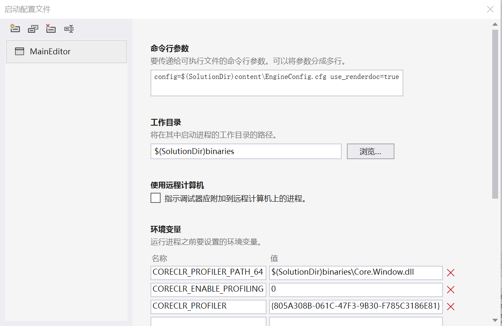
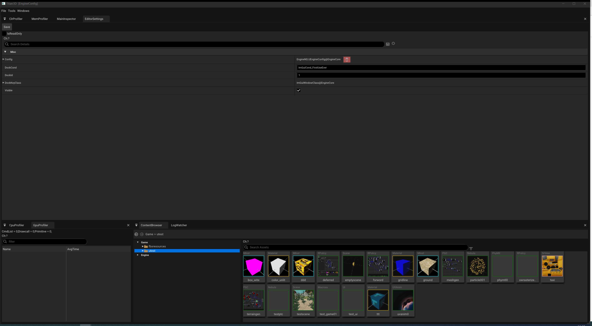
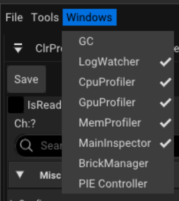
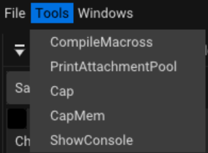
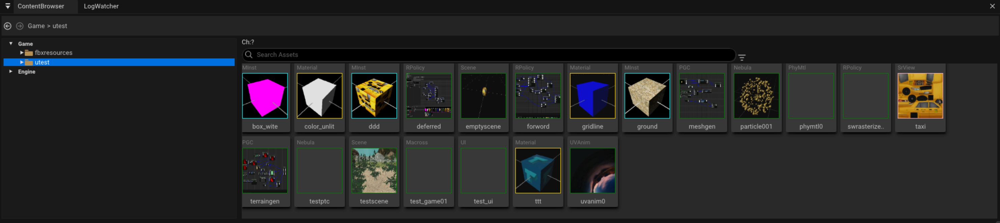
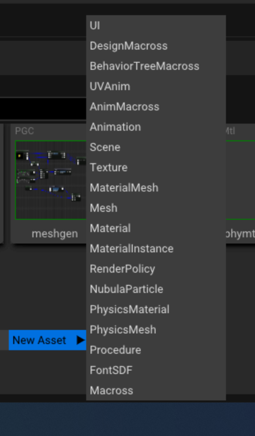

-  启动编辑器
- - 调试运行MainEditor工程
- - 修改启动配置，其中cfg文件可以修改引擎的各种启动参数

-  编辑器总览

- - **LogWatcher**
- - **GpuProfiler**
- - **MemProfiler**
- - **ClrProfiler**
- - **PIEController**
- MainMenu
这里可以打开和关闭一些编辑器的窗口

这里是一些运行时的工具或者功能

- ContentBrowser
双击资产图标可以启动对应资产编辑器

右键空白处可以新建资产

- 带3D预览的编辑器操作
- - **移动**:ASWD或者按住鼠标中键盘移动
- - **绕观察点旋转**:按住Alt键和鼠标左键拖动
- - **摄像机自身旋转**:鼠标右键拖动
- 内置编辑器
- - **TextureEditor**
- - **MeshEditor**
- - **MaterialEditor**
- - **MaterialInstanceEditor**
- - **MaterialedMeshEditor**
- - **NebulaParticleEditor**
- - **RendPolicyEditor**
- - **SceneEditor**
- - **MacrossEditor**
- - **PGCEditor**
- - **UIEditor**

- 基础教程
- 在ContentBrowser的tutorials下面有对应的子目录
- - helloworld
- - material
- - mcshader
- - particles
- - pbr
- - prefab
- - renderpolicy
- - terrain
- - viewinstance