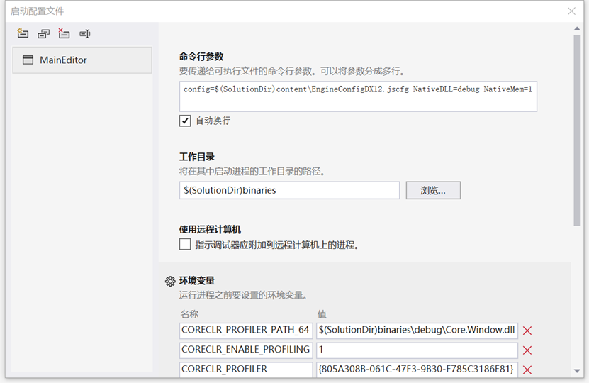
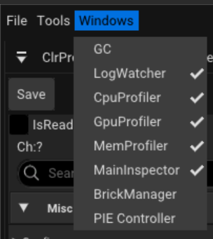
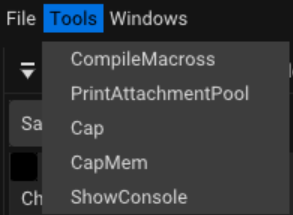
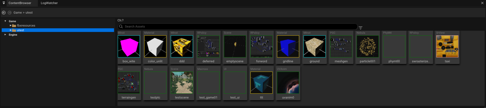
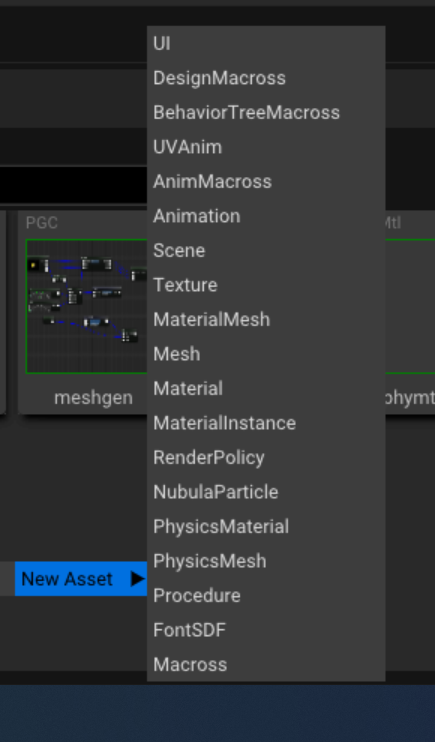

-  启动编辑器
- - 调试运行MainEditor工程
- - 修改启动配置，其中jscfg文件可以修改引擎的各种启动参数
- - Cache/DynConfigData.dcd文件是一些当前引擎编辑器配置保存文件
- - - 程序设置配置示例：TtEngine.Instance.DynConfigData.SetConfig("LastPIEName", mCurrentName)
- - - 程序读取配置示例：var cfgName = TtEngine.Instance.DynConfigData.GetConfig("LastPIEName") as RName;
- - - 配置格式：\{key\}:\{TypeString\}=\{Value\}
- - - 希望注释一行，就在行开始用##标志
- - - [支持的配置](editor/DynConfig.md)
- - VS调试配置

	- 启动一个配置文件，是一个json文件:config=$(SolutionDir)content\EngineConfigDX12.jscfg
	- 是否调试C++引擎代码:NativeDLL=debug
	- 是否开启C++内存分析:NativeMem=1
	- [引擎配置文件](engine/EngineConfig.md)
-  编辑器总览

- - **[ContentBrowser](editor/ContentBrowser.md)**
- - **[LogWatcher&Command](editor/LogWatcher.md)**
- - **[CpuProfiler](editor/CpuProfiler.md)**
- - **[GpuProfiler](editor/GpuProfiler.md)**
- - **[MemProfiler](editor/MemProfiler.md)**
- - **[ClrProfiler](editor/ClrProfiler.md)**
- - **[PIEController](editor/PIEController.md)**
- MainMenu
这里可以打开和关闭一些编辑器的窗口

这里是一些运行时的工具或者功能

- ContentBrowser
双击资产图标可以启动对应资产编辑器

右键空白处可以新建资产

- 带3D预览的编辑器操作
- - **移动**:ASWD或者按住鼠标中键盘移动
- - **绕观察点旋转**:按住Alt键和鼠标左键拖动
- - **摄像机自身旋转**:鼠标右键拖动
- 内置编辑器
- - **[TextureEditor](editor/TextureEditor.md)**
- - **[MeshPrimitiveEditor](editor/MeshPrimitiveEditor.md)**
- - **[MaterialEditor](editor/MaterialEditor.md)**
- - **[MaterialFunctionEditor](editor/MaterialFunctionEditor.md)**
- - **[MaterialInstanceEditor](editor/MaterialInstanceEditor.md)**
- - **[MaterialedMeshEditor](editor.MaterialedMeshEditor.md)**
- - **[NebulaParticleEditor](editor/NebulaParticleEditor.md)**
- - **[RendPolicyEditor](editor/RendPolicyEditor.md)**
- - **[SceneEditor](editor/SceneEditor.md)**
- - **[MacrossEditor](editor/MacrossEditor.md)**
- - **[PGCEditor](editor/PGCEditor.md)**
- - **[UIEditor](editor/UIEditor.md)**

- **架构与行业对比**
- - **[Render Graph 与业界主流引擎横向对比](engine/RenderGraph.Industry.Compare.md)**
    - TitanEngine 自研 RDG (`TtRenderGraph` / `TtAttachmentCache`) 与
      UE5 RDG / Unity URP-HDRP RG / Frostbite FrameGraph / Granite / O3DE Atom /
      Stride GraphicsCompositor / Falcor / Bevy bevy_render 的全维度横向对比。
    - 一句话定位: **业界第一档 RDG 能力 + 业界少见的"主渲染管线可视化编辑器"
      + Permutation / RenderPolicy 资产化, 三者同时具备的引擎全球不超过 5 个**。
    - 含演进路线图 (memory aliasing / pass merging / async compute 自动调度等)。
    - 对外宣讲 / 行业汇报 / 招聘材料的"硬数据"统一来源, 持续更新。

- 基础教程
- 在ContentBrowser的tutorials下面有对应的子目录
- - [helloworld](tutorials/helloworld.md)
- - [material](tutorials/material.md)
- - [mcshader](tutorials/mcshader.md)
- - [particles](tutorials/particles.md)
- - [pbr](tutorials/pbr.md)
- - [prefab](tutorials/prefab.md)
- - [renderpolicy](tutorials/renderpolicy.md)
- - [terrain](tutorials/terrain.md)
- - [viewinstance](tutorials/viewinstance.md)
- - [mc_cmd](tutorials/mc_cmd.md)
- - [pivotpainter](tutorials/pivotpainter.md)
- - [character](tutorials/character.md)