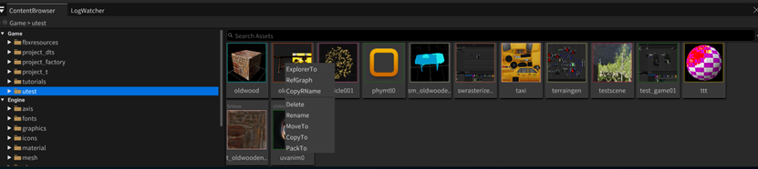
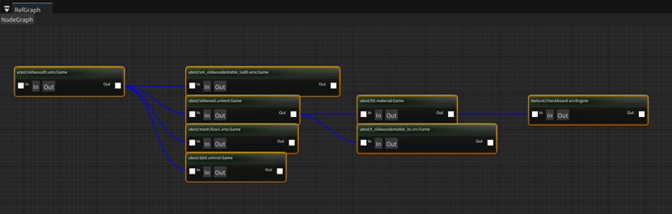

- ContentBrowser
	- 
	- 在文件上右键弹出操作菜单
	- - ExploreTo:资源浏览器打开
	- - RefGraph:打开本资源的资源引用图
	- - CopyRName:拷贝路径
	- - Delete:删除资产
	- - Rename:重命名资产
	- - MoveTo:移动资产
	- - CopyTo:拷贝资产
	- - PackTo:把本资产和他引用资产复制到指定目录
- RefGraph
	- 
	- - In按钮点出谁引用了自己
	- - Out按钮点出自己引用了谁