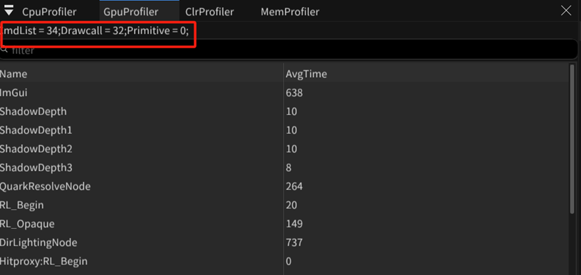

-  利用在GPU内插入Begin/End对查询Gpu消耗
	- 编辑器读取
	- - 
	  - 图上红框内现实的Drawcall等数据
	  - 下面是CmdList执行某些任务的GPU消耗时间
	  - 后续计划给GpuScope增加TreeMode显示
	- 添加TtGpuScope
	- - 缺省，在UCommandList类中，BeginPass/EndPass会配对调用TtGpuScope CurrentGpuScope进行时间采样
	- - 利用类似CurrentGpuScope = TtEngine.Instance.ProfilerModule.GpuTimeScopeManager.GetGpuScope(name)方法获得一个命名的GpuScope