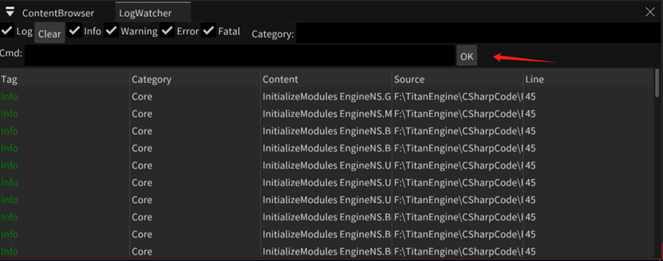

- 日志查看
- - 选择checkbox筛选显示的日志
  - Category可以进一步筛选
- Command
	- 在如图红箭头处输入命令行
    - 
	- 命令格式 CommandName ArgName1=XXXX ArgName2=YYYY
	- 新增命令
	- - C#代码扩展
    ```C#
        public class TtCommand_DelMaterialShaderCache : TtCommand
        {
            public TtCommand_DelMaterialShaderCache()
            {
                CmdName = "DelMaterialCache";
                CmdHelp = "DelMaterialCache Material={string}";
            }
            public override void Execute(string argsText)
            {
                _ = ExecuteImpl(argsText);
            }
            private async Thread.Async.TtTask ExecuteImpl(string argsText)
            {
                var args = GetArguments(argsText);
                var arg = FindArgument(args, "Material");
                var mtlName = GetRNameByArg(arg, null);
                var mtl = await TtEngine.Instance.GfxDevice.MaterialManager.GetMaterial(mtlName);
                if (mtl == null)
                    return;
                var files = IO.TtFileManager.GetFiles(TtEngine.Instance.FileManager.GetPath(IO.TtFileManager.ERootDir.Cache, IO.TtFileManager.ESystemDir.Effect), "*.effect", true);
                foreach (var i in files)
                {
                    var desc = Graphics.Pipeline.Shader.TtEffect.LoadEffectDesc(i);
                    if (desc.MaterialHash == mtl.MaterialHash)
                    {
                        IO.TtFileManager.DeleteFile(i);
                    }
                }
            }
        }
    ```
	- - 宏图扩展
      - 创建一个TtCommandMacross，参照教程[McCmd](../tutorials/mc_cmd.md)制作
	- 内置常用命令
    - - 启动一个宏图命令 McCmd Macross=(string) OnGameThread=(bool)
      - 显示所有命令列表 List Filter=(string)
      - 显示命令帮助 Help Cmd=(string)
      - 打印RenderGraph的池信息 PrintAttachmentPool
      - 删除指定材质的ShaderCache DelMaterialCache Material={string}