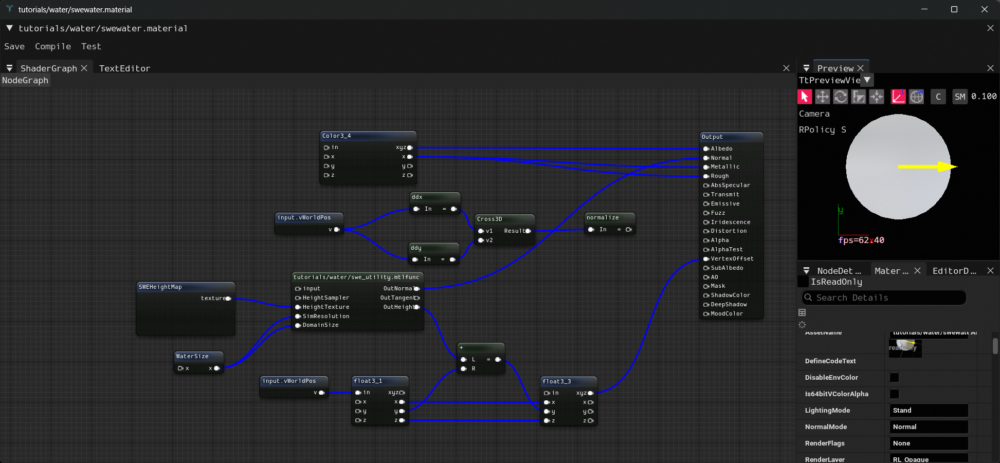
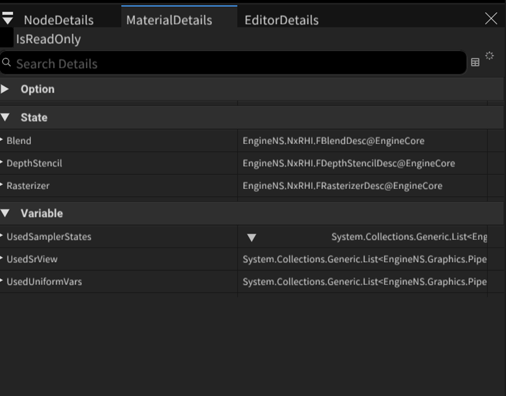
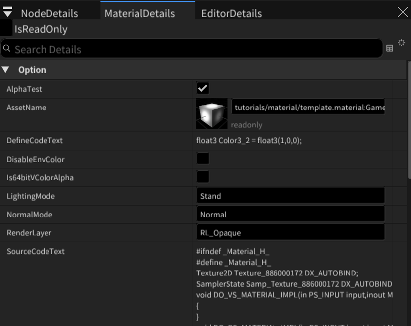
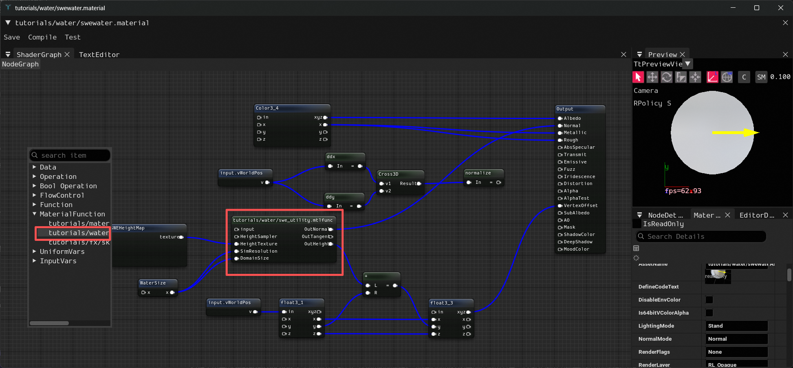

## 材质编辑器 (Material Editor)

材质编辑器用于创建和编辑引擎的材质资产（`.material`），通过可视化节点图的方式连接各种运算、纹理采样、函数调用等节点，最终输出到材质的各个物理属性通道，编译生成 HLSL 着色器代码。

### 主界面

编辑器采用多面板 Dock 布局，各面板均可自由拖拽和停靠：

| 面板 | 位置 | 说明 |
|---|---|---|
| **ShaderGraph** | 中间主区域 | 节点图编辑区，右键打开节点菜单，拖拽连线构建材质逻辑 |
| **TextEditor** | 与 ShaderGraph 同 Tab | HLSL 代码预览（只读），点击 Compile 后自动更新 |
| **Preview** | 右上 | 3D 实时预览窗口，默认使用球体网格显示当前材质效果 |
| **NodeDetails** | 右下 | 选中节点的属性面板，可编辑节点参数（如变量值、名称等） |
| **MaterialDetails** | 右下 | 材质整体属性面板，设置光照模式、法线模式、渲染层等 |
| **EditorDetails** | 右下 | 预览视口的设置面板，如相机、光照环境等 |

### 工具栏

编辑器顶部提供三个操作按钮：

- **Save** — 保存当前材质，序列化节点图到材质资产文件并触发热重载
- **Compile** — 编译节点图生成 HLSL 代码，结果会同步显示在 TextEditor 面板中，可用于检查生成的着色器代码是否正确
- **Test** — 将材质渲染到纹理并导出为 PNG 图片（保存到资产同目录），用于离线验证材质输出结果

### 渲染状态设置

在 MaterialDetails 面板中可以设置材质的渲染状态，包括混合模式、深度测试、模板测试、光栅化状态等。

### 材质设置

这里设置材质的全局选项：

- **光照模式（LightingMode）** — 选择材质的光照计算方式
- **法线模式（NormalMode）** — 设置法线的来源和计算方式，详见下文
- **渲染层（RenderLayer）** — 控制材质在哪些渲染通道中生效（Opaque、Translucent 等）
- **AlphaTest** — 是否启用 Alpha 测试

### 法线模式详解

法线模式决定了着色器中如何获取和处理片元法线，对应宏 `MTL_NORMAL_MODE`，共有三个选项：

| 模式 | 宏定义 | 说明 |
|---|---|---|
| **NormalMap** | `MTL_NORMALMAP` | **默认值**。从法线贴图中采样，在切线空间中解码后转换到世界空间。需要模型提供切线（Tangent）信息，适用于静态网格、标准 PBR 材质等 |
| **Normal** | `MTL_NORMAL` | 直接使用 Output 节点 Normal 引脚输入的 Vector3 作为世界空间法线，不做切线空间变换。适用于自行计算法线的场景 |
| **NormalNone** | `MTL_NORMALNONE` | 不处理法线，使用顶点插值后的几何法线。适用于不需要法线细节的简单材质（如 Unlit、粒子等） |

**如何选择法线模式：**

- 普通的 PBR 材质、有法线贴图的模型 → 选 **NormalMap**
- 使用了 **VertexOffset** 扰动顶点位置的材质（如水面波浪、地形变形、程序化网格等） → 通常需要选 **Normal**，因为顶点位置被修改后原始的切线空间已经失效，法线贴图采样会产生错误结果。此时需要在节点图中自己计算扰动后的法线（例如通过 `ddx`/`ddy` 对位置求偏导数再叉乘），然后直接输出到 Output 的 Normal 引脚
- 不关心法线的材质（Unlit 自发光、粒子、UI 等） → 选 **NormalNone**

> **典型错误**：对使用了 VertexOffset 的材质仍然保留 NormalMap 模式，会导致法线方向与实际变形后的表面不一致，表现为光照闪烁、高光方向错误等问题。正确做法是切换到 Normal 模式并手动计算变形后的法线。

### Output 节点

Output 节点是每个材质图必须包含的终端节点，所有材质属性都通过连接到 Output 节点的对应引脚来赋值。引脚列表如下：

| 引脚 | 类型 | 说明 |
|---|---|---|
| **Albedo** | Vector3 | 基础颜色（漫反射颜色） |
| **Emissive** | Vector3 | 自发光颜色 |
| **Normal** | Vector3 | 法线方向 |
| **Metallic** | float | 金属度 |
| **Rough** | float | 粗糙度 |
| **Alpha** | float | 透明度 |
| **AlphaTest** | float | Alpha 测试阈值 |
| **AO** | float | 环境光遮蔽 |
| **VertexOffset** | Vector3 | 顶点偏移（在 VS 中执行） |

### 右键节点菜单

在 ShaderGraph 面板空白处右键可打开节点创建菜单，节点按以下分类组织：

- **Operation** — 运算节点
  - 二元运算：`+`、`-`、`*`、`/`、`%`、`&`、`|`
  - 一元函数：`ddx`、`ddy`、`fwidth`、`sin`、`cos`、`abs`、`normalize`、`saturate` 等
- **Function** — HLSL 内置函数节点
  - **Texture** — 纹理采样（Sample2D、SampleLevel2D、SampleArray2D 等）
  - **Math** — 数学函数（Dot3D、Cross3D、Lerp、Clamp、Pow、Frac 等）
  - **Effect** — 效果函数（GrayColor、NormalMap、Panner、Rotator、RimLight 等）
  - **Pivot** — 顶点动画相关函数
- **MaterialFunction** — 自定义材质函数列表，可以调用其他材质函数资产
- **UniformVars** — Uniform 变量节点
  - **PerFrame** — 每帧更新的全局变量
  - **PerCamera** — 每相机更新的变量

### 调用材质函数

右键菜单中的 **MaterialFunction** 子菜单列出了所有已注册的材质函数，选择后即可在图中创建调用节点，其输入输出引脚会根据材质函数的定义自动生成。