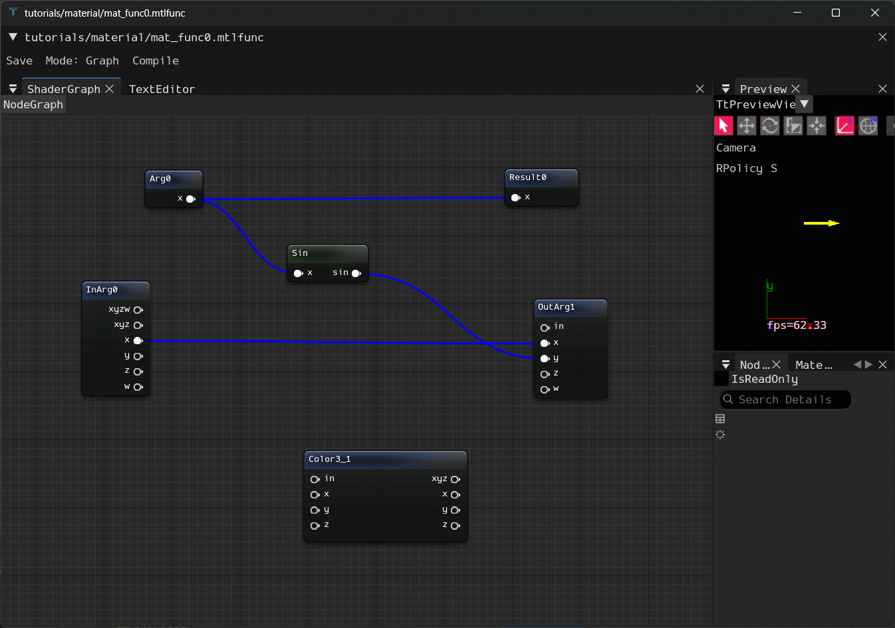
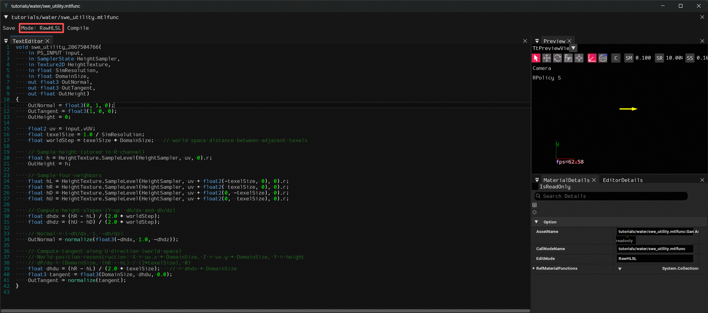
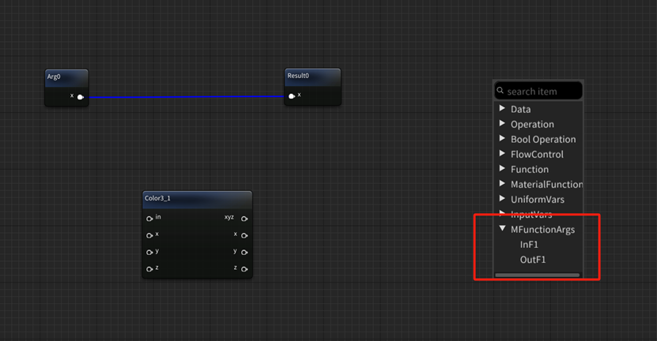

## 材质函数编辑器 (Material Function Editor)

材质函数编辑器用于创建和编辑可复用的材质函数资产（`.matfunc`）。材质函数可以封装一段通用的着色器逻辑，供多个材质或其他材质函数调用，避免重复搭建相同的节点图。

### 主界面



编辑器的整体布局与材质编辑器类似，但根据编辑模式不同，面板组合会有所变化：

| 面板 | Graph 模式 | RawHLSL 模式 | 说明 |
|---|---|---|---|
| **ShaderGraph** | ✅ | ❌ | 节点图编辑区 |
| **TextEditor** | ✅（只读） | ✅（可编辑） | HLSL 代码查看 / 编辑 |
| **NodeDetails** | ✅ | ❌ | 选中节点的属性面板 |
| **MaterialDetails** | ✅ | ✅ | 材质函数属性面板（设置函数名等） |
| **EditorDetails** | ✅ | ✅ | 预览视口设置 |
| **Preview** | ✅ | ✅ | 3D 实时预览窗口 |

### 两种编辑模式

材质函数支持两种编辑模式，通过工具栏的 **Mode** 按钮切换：

- **Graph 模式** — 通过节点图可视化搭建函数逻辑，TextEditor 面板显示编译后的 HLSL 代码（只读），适合需要可视化编辑的场景
- **RawHLSL 模式** — 直接在 TextEditor 面板中手写 HLSL 代码，保存时自动解析函数签名（`ParseMethodMetaFromHLSL`），适合有经验的 TA 快速编写复杂函数

> 切换模式时面板布局会自动重新排列。RawHLSL 模式下 ShaderGraph 和 NodeDetails 面板会隐藏，TextEditor 成为主编辑区域。

#### RawHLSL 模式示例



上图展示了一个水面工具函数 `swe_utility` 的 RawHLSL 编辑示例：

- **工具栏**左侧可以看到 `Mode: RawHLSL` 按钮处于激活状态
- **TextEditor** 面板占据主编辑区域，可以直接编写完整的 HLSL 函数代码
- **函数签名**按照 HLSL 语法定义输入输出参数（`in`/`out` 修饰符），编辑器会在保存时自动解析参数列表，生成对应的调用节点元信息
- **MaterialDetails** 面板右下方显示了函数属性，包括 `AssetName`、`CallNodeName`（在材质编辑器中显示的节点名称）以及 `EditMode: RawHLSL`

RawHLSL 模式特别适合编写涉及复杂数学运算的函数（如上图中的高度图采样、法线/切线计算等），比节点图方式更高效直观。

#### RawHLSL 模式下的注释支持

编辑器在解析函数签名时会**自动忽略注释**，因此可以在参数列表中自由使用注释来组织代码：

```hlsl
void my_function_123456(
    in PS_INPUT input,
    // --- Section A ---
    in float3 ParamA,
    in float ParamB,           // some description (with parentheses)
    /* block comment */
    // --- Section B ---
    out float3 Result)
```

支持的注释格式：
- 单行注释 `// ...`（可以包含任意字符，包括括号）
- 多行注释 `/* ... */`
- 纯注释行（如 `// --- Section ---`）会被跳过，不会产生参数

#### 参数默认值注解 (`@default`)

HLSL 函数参数不支持语言级别的缺省值。引擎通过行内注释中的 **`@default(...)`** 标记来声明参数默认值。在材质编辑器中，调用节点**未连线的输入端口**会自动使用 `@default` 中指定的值。

**语法格式：**

```hlsl
in float MyParam,              // @default(1.5)
in float3 MyColor,             // @default(0.1, 0.2, 0.3)
in float4 MyVec,               // @default(1.0, 0.0, 0.0, 1.0)
```

**完整示例：**

```hlsl
void water_shine_2296793692(
    in PS_INPUT input,
    in float3 WaterNormal,
    in float3 WaterTangent,
    in float WaterHeight,
    in Texture2D DetailNormalMap,
    in SamplerState DetailNormalSampler,
    in float DetailNormalScale,        // @default(12.0)
    in float DetailNormalStrength,     // @default(0.6)
    in float FlowSpeed1,              // @default(0.04)
    in float FlowSpeed2,              // @default(0.06)
    in float3 DeepWaterColor,         // @default(0.02, 0.15, 0.3)
    in float3 ShallowWaterColor,      // @default(0.1, 0.5, 0.6)
    in float WaterRoughness,          // @default(0.04)
    out float3 OutAlbedo,
    out float3 OutNormal,
    out float OutRoughness)
{
    // ...
}
```

**规则：**

| 规则 | 说明 |
|------|------|
| 位置 | 注解必须写在参数**同一行**的 `//` 注释中 |
| 格式 | `@default(值)`，多分量用逗号分隔 |
| 支持类型 | `float`、`float2`、`float3`、`float4`、`int`、`uint` |
| 不支持 | `Texture2D`、`SamplerState`、`PS_INPUT` 无法设置默认值 |
| `out` 参数 | 不需要 `@default`，应在函数体开头赋初始值 |
| 可选 | 没有 `@default` 的数值参数使用类型零值（如 `float` → `0.0`） |

> **注意：** `@default` 中的逗号不会被误认为参数分隔符，因为解析器会先提取注解再去除注释后分割参数列表。

### 工具栏

- **Save** — 保存材质函数资产并触发热重载
  - Graph 模式：序列化节点图为 XML 并保存
  - RawHLSL 模式：保存 TextEditor 中的代码并自动解析函数签名
- **Mode: Graph / Mode: RawHLSL** — 切换编辑模式
- **Compile** — 编译当前函数
  - Graph 模式：根据节点图生成 HLSL 代码，结果显示在 TextEditor
  - RawHLSL 模式：读取 TextEditor 中的代码并解析函数元信息

### 函数输入输出节点



相比材质编辑器，材质函数编辑器在右键菜单中多出了 **MFunctionArgs** 子菜单，用于定义函数的输入和输出参数。右键空白区域 → MFunctionArgs 可以创建以下节点：

**输入节点（In）：**

| 节点 | 类型 | 说明 |
|---|---|---|
| **InTex2D** | Texture2D | 纹理输入参数 |
| **InSampler** | SamplerState | 采样器输入参数 |
| **InF1** | float | 单分量浮点输入 |
| **InF2** | Vector2 | 二分量浮点输入 |
| **InF3** | Vector3 | 三分量浮点输入 |
| **InF4** | Vector4 | 四分量浮点输入 |

**输出节点（Out）：**

| 节点 | 类型 | 说明 |
|---|---|---|
| **OutF1** | float | 单分量浮点输出 |
| **OutF2** | Vector2 | 二分量浮点输出 |
| **OutF3** | Vector3 | 三分量浮点输出 |
| **OutF4** | Vector4 | 四分量浮点输出 |

**注意事项：**
- In 节点可以没有（无参函数），但 **Out 节点至少要有一个**，否则函数没有输出无法被调用
- 每个节点创建后会自动命名为 `InArg0`、`OutArg1` 等，建议在 NodeDetails 面板中修改为有意义的参数名
- 在 **MaterialDetails** 面板中可以为本材质函数设置一个合适的显示名称，该名称会出现在材质编辑器的 MaterialFunction 右键菜单中

### 使用流程

1. 在资源浏览器中创建新的材质函数资产，双击打开材质函数编辑器
2. 选择编辑模式（Graph 或 RawHLSL）
3. **Graph 模式**：
   - 通过右键菜单 MFunctionArgs 创建所需的输入/输出节点
   - 使用 Operation、Function 等节点搭建中间计算逻辑
   - 将计算结果连接到 Out 节点
4. **RawHLSL 模式**：
   - 直接在 TextEditor 中编写 HLSL 函数代码
   - 确保函数签名格式正确，编辑器会自动解析参数
5. 点击 **Compile** 验证代码正确性
6. 点击 **Save** 保存
7. 在材质编辑器中通过右键菜单 **MaterialFunction** 调用此函数