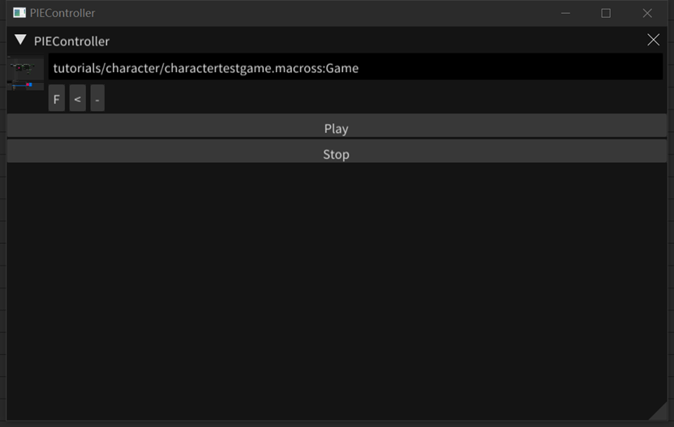
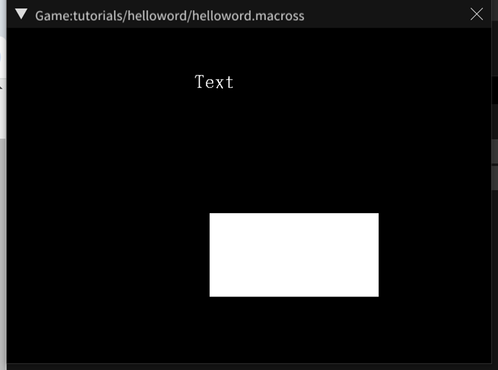
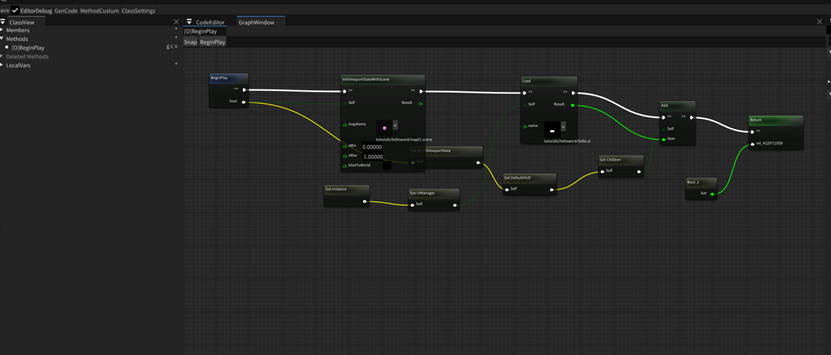

- 菜单选择菜单Windows->PIE Controller
- - 
- - 选择一个游戏宏图
- - 点击Play
- 运行起来选择的游戏
- - 
- 游戏宏图
- - 
- - 本宏图在教程[helloworld](../tutorials/helloworld.md)
- - 第一个节点初始化游戏窗口，参数主要是渲染策略，加载的地图
- - 第二个节点加载UI
- - 第三个节点将UI加载到Viewport