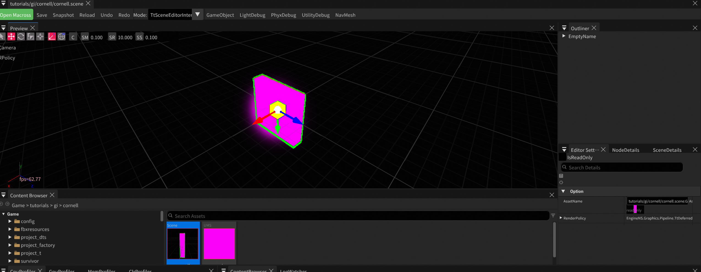

# SceneEditor 场景编辑器使用指南

`SceneEditor` 是 TitanEngine 的核心场景搭建工具，用于打开 / 编辑 / 保存 `.scene` 资产，配合 Outliner、属性面板、Content Browser 与 Camera/RenderPolicy 设置完成场景的可视化编辑。

> 对应代码：
> - 编辑器主体：`CSharpCode/Editor/Forms/SceneEditor.cs`
> - 视口与交互模式：`CSharpCode/Editor/Forms/TtSceneEditorInteractiveMode.cs`、`CSharpCode/Editor/PreviewViewport.cs`、`CSharpCode/ImGui/Slate/TtWorldViewportInteractiveMode.cs`
> - 视口面板栏 / Axis / Camera 弹窗：`CSharpCode/Grapics/Pipeline/ViewportSlate.cs`
> - 节点拾取与坐标轴：`CSharpCode/GamePlay/Axis.cs`、`CSharpCode/Grapics/Pipeline/HitproxyManager.cs`

---

## 1. 总览



打开任意 `.scene` 资产（在 Content Browser 双击，或从 PIE 工具栏新建）后，编辑器界面分区如下：

| 区域 | 位置 | 主要职责 |
|---|---|---|
| **主菜单栏** | 窗口顶端 | 工程级 / 编辑器级菜单（File / Windows / View / Illumination 等） |
| **工具栏** | Tab 标题之下，横排按钮 | 当前 .scene 的常用操作：Save / Reload / Undo / Redo / Mode 切换 / 节点过滤 |
| **Preview 视口** | 中间最大区域 | 3D 场景预览 + Axis 拖动 + 鼠标 / 键盘相机控制 |
| **视口面板栏** | Preview 视口左上角 | Axis 模式 (Move/Rot/Scale)、AABB/球面、相机弹窗、SnapMove/Rot/Scale、RenderPolicy |
| **Outliner** | 右上 | 场景节点树，单击 / Ctrl+单击选中节点 |
| **属性面板（三个 Tab）** | Outliner 下方 | `Editor Settings` / `NodeDetails` / `SceneDetails` |
| **Content Browser** | 窗口下方 | 资产浏览，双击 .scene 切换打开 |
| **Profilers** | 最底部 tab 区 | CpuProfiler / GpuProfiler / MemProfiler / ClrProfiler / LogWatcher |

> 视口左下角的 **xyz 小坐标轴** + `fps=xx.xx` 用于直观判断当前视图朝向和帧率。

---

## 2. 工具栏（顶部一排按钮）

工具栏紧跟在 Tab 标题（例如 `tutorials/gi/cornell/cornell.scene`）下面，从左到右：

| 按钮 | 说明 |
|---|---|
| **Open Macross** | 打开 / 切换该场景关联的 Macross 蓝图脚本 |
| **Save** | 保存当前 .scene 到磁盘（写回 AssetName 路径） |
| **Snapshot** | 截取当前预览图作为资产缩略图 |
| **Reload** | 丢弃未保存改动，从磁盘重新加载 .scene |
| **Undo / Redo** | 编辑撤销 / 重做（基于命令栈） |
| **Mode：下拉框** | 当前视口的 `TtInteractiveMode`，默认 `TtSceneEditorInteractiveMode`（含 Ctrl+Drag 复制），可切到基类 `TtWorldViewportInteractiveMode`（仅基础相机操作） |
| **GameObject** | 节点种类过滤（开关） |
| **LightDebug / PhyxDebug / UtilityDebug / NavMesh** | 各类 Debug 节点过滤（开关） |

> Mode 下拉框列出所有已通过 `InteractiveModeManager.RegisterMode` 注册的 Mode；新增 Mode 时只需在 `TtSceneEditorViewport` 静态构造函数里注册一次，下拉框自动出现。

---

## 3. Preview 视口

视口是编辑器的核心区域，3D 场景在这里被实时渲染。视口左上角有一排小图标（面板栏），主体响应鼠标 / 键盘 / 滚轮事件。

### 3.1 视口面板栏（左上小图标，从左到右）

| 图标 | 含义 | 说明 |
|---|---|---|
| ▶️ | **Pick 模式** | 切回普通选择，不显示 Axis |
| ✥ | **Move 模式** | 显示移动坐标轴（红 X / 绿 Y / 蓝 Z 箭头），拖动平移选中节点 |
| 🔄 | **Rotate 模式** | 显示旋转环，拖动绕轴旋转 |
| 🟦 | **Scale 模式** | 显示缩放手柄，拖动缩放选中节点 |
| 📏 | **Edge 模式** | 边吸附编辑（用于点 / 边 / 面级别操作） |
| 🟫 / ⚪ | **AABB / Sphere 切换** | 选中节点高亮包围体显示形式：立方体或球 |
| **C** | **Camera 设置弹窗** | 弹出 KeyMove / WheelMove / RotSpeed / ZNear / ZFar / X / Y / Z 等参数 |
| **🔘 (RPolicy)** | **RenderPolicy 切换** | 弹窗选择当前视口的 RenderPolicy（Deferred / Forward / 自定义...） |
| `SM 0.100` | **Snap Move** | 移动吸附步长（米）；拖 Move 轴时按此值整数倍吸附 |
| `SR 10.000` | **Snap Rotate** | 旋转吸附步长（度） |
| `SS 0.100` | **Snap Scale** | 缩放吸附步长（倍率） |

> 控件由 `TtWorldViewportSlate.OnDrawViewportUI` 绘制，与 `Axis.SetType / Axis.MoveStep / RotStep / ScaleStep` 直接绑定。

### 3.2 视口左下信息

- **xyz 小坐标轴**：实时反映相机朝向（红=X, 绿=Y, 蓝=Z）
- **fps=xx.xx**：当前预览的 FPS

### 3.3 鼠标 / 键盘交互

视口默认行为来自 `TtSceneEditorInteractiveMode`（继承 `TtWorldViewportInteractiveMode`）：

| 输入 | 行为 |
|---|---|
| **左键单击空白** | 取消选中 |
| **左键单击节点** | 选中该节点（走 Hitproxy 拾取） |
| **Ctrl + 左键单击节点** | 切换该节点的多选状态 |
| **左键拖 Axis** | 平移 / 旋转 / 缩放选中节点（取决于当前 Axis 模式） |
| **Ctrl + 左键拖 Move 轴** | **复制并拖动**：同步克隆选中节点（NodeName 自动加 `_Copy`，分配新 HitProxy ProxyId），选择切换到副本 |
| **Alt + 左键拖** | 围绕 LookAt 点 **轨道旋转** 相机 |
| **中键拖 / X1 拖** | **平移** 相机（沿屏幕平面） |
| **滚轮** | 沿视线 **推进 / 后退** 相机，LookAt 同步推进（`CameralWheelMoveWithLookAt = true`） |
| **W / A / S / D** | **飞行式** 相机移动 |
| **F** | 把当前选中节点的包围球 **Frame** 到视野中央 |
| **Delete** | 删除选中节点 |

> Mode 下拉框切到 `TtWorldViewportInteractiveMode` 时，Ctrl+Drag 复制功能失效，其它操作不变。适合需要"纯净相机操作"的场景。

---

## 4. 右侧面板

### 4.1 Outliner（右上）

显示当前 .scene 的节点树，例如：

```
EmptyName       <- 根节点 (Scene)
├─ red          <- 选中态高亮蓝色背景
├─ GridLine
└─ red_Copy     <- Ctrl+Drag 复制出的节点
```

- **单击节点名**：选中节点（与视口 hitproxy 拾取双向同步）
- **Ctrl + 单击**：多选 / 反选
- **左侧 ▶ 折叠箭头**：展开 / 折叠子节点
- **拖拽**：改变父子层级（将节点拖到目标父节点上）

### 4.2 属性面板三 Tab（Outliner 下方）

| Tab | 显示对象 | 典型用途 |
|---|---|---|
| **Editor Settings** | 编辑器自身的属性 (`EditorPropGrid.Target`) | `IsReadOnly` 锁编辑、查看 `AssetName`、切换 `RenderPolicy` |
| **NodeDetails** | 当前选中节点 (`NodeInspector.Target`) | 编辑 Position / Rotation / Scale / 材质 / 自定义脚本字段 |
| **SceneDetails** | 当前 .scene 资产本身 (`ScenePropGrid.Target = Scene`) | 编辑场景级属性（后处理、雾、GI 设置等） |

#### Editor Settings 关键字段

- **IsReadOnly**：勾选后禁用所有改动，用于"看图不动手"
- **AssetName**：当前 .scene 的资产路径（只读 chip）
- **RenderPolicy**：当前视口使用的 `TtRenderPolicy` 类型（例如 `EngineNS.Graphics.Pipeline.TtDeferred`）

> 多选时 `NodeDetails` 显示 PropertyGrid 的多对象交集编辑模式，共同字段可批量改。

### 4.3 Camera Settings（C 按钮弹出）

| 字段 | 说明 |
|---|---|
| **KeyMove** | WASD 键的相机移动速度（米/秒） |
| **WheelMove** | 滚轮单次推进的距离 |
| **RotSpeed** | Alt+左键旋转的角速度 |
| **ZNear / ZFar** | 视锥的近 / 远裁剪面，影响深度精度 |
| **X / Y / Z** | 相机当前世界坐标（可直接输入跳转） |

---

## 5. 底部 Content Browser

整个窗口下半部分嵌入 Content Browser（与独立的 ContentBrowser 编辑器同源）：

- **左侧目录树**：工程下所有资产文件夹（`Game > tutorials > gi > cornell` 等）
- **中间面包屑**：当前路径
- **右侧资产卡片**：缩略图 + 名称，双击 `.scene` 切到该场景，双击 `.uminstance` / `.material` 等会打开对应编辑器
- **Search Assets**：资产模糊搜索

详见 [ContentBrowser 文档](ContentBrowser.md)。

---

## 6. 主菜单（窗口顶部）

| 菜单 | 项 | 作用 |
|---|---|---|
| **File** | New / Open / Save / Save As / Exit | 工程级文件操作 |
| **Edit** | Undo / Redo / Preferences | 全局编辑操作 |
| **Windows** | 各面板的显示 / 隐藏（Outliner、NodeDetails、Content Browser、Profilers ...） | 重置 / 自定义工作区布局 |
| **View** | DisableShadow / DisableAO / DisableHDR / DisablePointLight | 临时关闭某些渲染特性，便于排查问题 |
| **Illumination** | VoxelDebugger / ResetVoxels | GI / 体素相关调试入口（具体行为依 RenderPolicy） |

---

## 7. 快捷键速查

| 分类 | 快捷键 | 功能 |
|---|---|---|
| 选择 | **左键单击** | 选中节点 |
| 选择 | **Ctrl + 左键单击** | 多选切换 |
| 选择 | **空白处单击** | 取消选中 |
| 编辑 | **左键拖 Move/Rot/Scale 轴** | 平移 / 旋转 / 缩放 |
| 编辑 | **Ctrl + 左键拖 Move 轴** | 复制并拖动（新节点 `_Copy` / `_Copy1` / `_Copy2` ...） |
| 编辑 | **Delete** | 删除选中节点 |
| 编辑 | **Ctrl + Z / Ctrl + Y** | Undo / Redo |
| 视图 | **Alt + 左键拖** | 轨道旋转相机 |
| 视图 | **中键拖** | 平移相机 |
| 视图 | **滚轮** | 沿视线推进 / 后退（LookAt 同步） |
| 视图 | **W / A / S / D** | 飞行式移动 |
| 视图 | **F** | Frame 选中节点到视野 |
| 文件 | **Ctrl + S** | Save |

---

## 8. 高级用法

### 8.1 Ctrl+Drag 节点复制

- **触发条件**：当前 Axis 在 Move 模式 + 至少有一个选中节点 + 鼠标 hover 在某条 Move 轴上 + 按住 Ctrl 后按下左键
- **复制规则**：
  - 通过 `TtNode.CloneNode` 同步克隆（递归子节点）
  - 新节点挂在源节点的 **同一 Parent** 下
  - `NodeName` 自动加 `_Copy` 后缀（重名时追加 `_Copy1` / `_Copy2` ...），反复复制不会出现 `red_Copy_Copy_Copy`
  - 自动分配 **新 HitProxy ProxyId**，原节点的拾取不受影响
- **多选支持**：选了 N 个节点会一次性复制 N 份，选中状态切到全部副本，Axis 直接拖整体

> 实现见 `TtSceneEditorInteractiveMode.OnEvent / TryStartClonedDrag / MakeUniqueNodeName`。

### 8.2 切换交互模式（Mode 下拉框）

工具栏 Mode 下拉框列出当前视口可用的所有 `TtInteractiveMode`：

- `TtSceneEditorInteractiveMode`（默认）：SceneEditor 专用，含 Ctrl+Drag 复制
- `TtWorldViewportInteractiveMode`：基础相机 + Axis，不含复制

> 添加自定义 Mode：实现一个继承 `TtWorldViewportInteractiveMode` 的类，在 `TtSceneEditorViewport` 静态构造函数里 `InteractiveModeManager.RegisterMode<TtMyMode>()`，启动后会自动出现在下拉框。

### 8.3 RenderPolicy 切换

- 工具栏面板的 **RPolicy** 按钮 / `Editor Settings` 的 `RenderPolicy` 字段，都可以切换当前视口使用的 RenderPolicy 类型（Deferred / Forward / 自定义）
- 切换后视口重建 RenderGraph，适合对比同一场景在不同管线下的表现差异

### 8.4 Snap 吸附（SM / SR / SS）

- `SM`：Move 拖动按此值整数倍 snap（默认 0.1m）
- `SR`：Rotate 拖动按此值整数倍 snap（默认 10°）
- `SS`：Scale 拖动按此值整数倍 snap（默认 0.1）
- 调小可获得连续操作，调大方便对齐网格

---

## 9. 常见问题 / 故障排查

| 问题 | 可能原因 | 解决 |
|---|---|---|
| **场景全紫色**（如截图所示） | 材质没找到 / Shader 编译失败 | 看 LogWatcher 报错，检查 .scene 引用的 .uminstance / .material 是否丢失 |
| **滚轮推不动相机** | LookAt 点没同步推进，推到 LookAt 处就停 | 确认 `CameralWheelMoveWithLookAt = true`（SceneEditor 默认开启） |
| **Ctrl+Drag 复制后点不中原节点** | HitProxy 共用了 ProxyId | 已通过 `cloned.HitproxyType = cloned.HitproxyType` 自赋值触发重新分配，确保使用最新版 `TtSceneEditorInteractiveMode` |
| **复制出的节点在 Outliner 都同名** | 历史版本未自动加后缀 | 已通过 `MakeUniqueNodeName` 自动追加 `_Copy[N]`，确保使用最新版 |
| **Mode 下拉框是空的** | 没有调用 `InteractiveModeManager.RegisterMode` | 检查 `TtSceneEditorViewport` 的静态构造函数 |
| **Save 不生效** | `IsReadOnly` 勾选了 | 在 `Editor Settings` 里取消勾选 |
| **F 键 Frame 不到位** | 节点 BoundVolume 为空或不正确 | 检查节点的 BoundVolume 计算，多见于自定义节点忘了实现包围体 |

---

## 10. 相关文档

- [ContentBrowser 资产浏览器](ContentBrowser.md)
- [MaterialEditor 材质编辑器](MaterialEditor.md)
- [MaterialedMeshEditor 带材质 Mesh 编辑器](MaterialedMeshEditor.md)
- [PIEController Play-In-Editor 控制器](PIEController.md)
- [RenderPolicyEditor 渲染管线编辑器](RendPolicyEditor.md)
- [GpuProfiler GPU 性能分析](GpuProfiler.md) / [CpuProfiler](CpuProfiler.md)
- [LogWatcher 日志窗口](LogWatcher.md)

---

> 本文档对应代码版本：见仓库当前 HEAD。UI 截图来自 `tutorials/gi/cornell/cornell.scene`。如新增了视口控件 / 交互模式 / 菜单项，请同步更新本文档对应章节。
