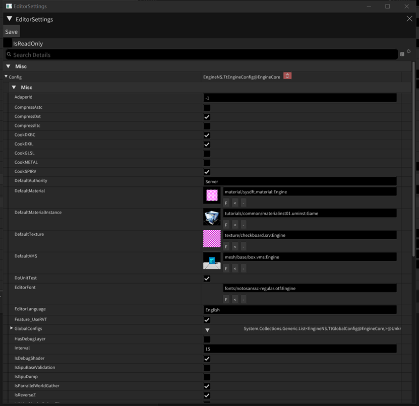

- 编辑Config
- - 
- - 点击Save后把配置存储到指定文件
- - 引擎通过启动参数config= 来指定配置文件
- 数据结构
```C#
    public partial class TtEngineConfig
    {
        public const int MajorVersion = 1;
        public const int MiniVersion = 4;
        public void SaveConfig(string sltFile)
        {
            IO.TtFileManager.SaveObjectToXml(sltFile, this);
        }
        [Rtti.Meta]
        public bool IsReverseZ { get; set; } = true;
        [Rtti.Meta]
        public EMultiRenderMode MultiRenderMode { get; set; } = EMultiRenderMode.QueueNextFrame;
        [Rtti.Meta]
        public bool UsePhysxMT { get; set; } = true;
        [Rtti.Meta]
        public bool UseRenderDoc { get; set; } = false;
        [Rtti.Meta]
        public bool Feature_UseRVT { get; set; } = false;
        public string ConfigName;
        [Rtti.Meta]
        public int NumOfThreadPool { get; set; } = -1;
        [Rtti.Meta]
        public bool IsParrallelWorldGather { get; set; } = true;
        int mInterval = 15;
        [Rtti.Meta]
        public int Interval {
            get => mInterval;
            set
            {
                mInterval = value;
                mTargetFps = 1000 / value;
            }
        }
        private int mTargetFps;
        public int TargetFps
        {
            get => mTargetFps;
        }
        [Rtti.Meta]
        public RName DefaultTexture { get; set; }
        [Rtti.Meta]
        public int AdaperId { get; set; }
        [Rtti.Meta]
        public Vector4 MainWindow { get; set; } = new Vector4(100, 100, 1280, 720);
        [Rtti.Meta]
        public bool SupportMultWindows { get; set; } = true;
        [Rtti.Meta]
        public bool DoUnitTest { get; set; } = true;
        [Rtti.Meta]
        public NxRHI.ERhiType RHIType { get; set; } = NxRHI.ERhiType.RHI_D3D11;
        [Rtti.Meta]
        public bool HasDebugLayer { get; set; } = false;
        [Rtti.Meta]
        public bool IsGpuBaseValidation { get; set; } = false;
        [Rtti.Meta]
        public bool IsDebugShader { get; set; } = false;
        [Rtti.Meta]
        public bool IsGpuDump { get; set; } = true;//if true, engine will disable debuglayer&renderdoc
        [Rtti.Meta]
        public string MainWindowType { get; set; }// = Rtti.TypeManager.Instance.GetTypeStringFromType(typeof(Editor.MainEditorWindow));
        [Rtti.Meta]
        public RName MainRPolicyName { get; set; }
        [Rtti.Meta]
        public RName SimpleRPolicyName { get; set; }
        [Rtti.Meta]
        public string RpcRootType { get; set; } = Rtti.TtTypeDesc.TypeStr(typeof(EngineNS.UTest.UTest_Rpc));
        [Rtti.Meta]
        public bool CookDXBC { get; set; } = true;
        [Rtti.Meta]
        public bool CookDXIL { get; set; } = false;
        [Rtti.Meta]
        public bool CookSPIRV { get; set; } = false;
        [Rtti.Meta]
        public bool CookGLSL { get; set; } = false;
        [Rtti.Meta]
        public bool CookMETAL { get; set; } = false;
        [Rtti.Meta]
        public bool CompressDxt { get; set; } = true;
        [Rtti.Meta]
        public bool CompressEtc { get; set; } = false;
        [Rtti.Meta]
        public bool CompressAstc { get; set; } = false;
        [Rtti.Meta]
        public RName DefaultVMS { get; set; } = RName.GetRName("mesh/base/box.vms", RName.ERNameType.Engine);
        [Rtti.Meta]
        public RName DefaultMaterial { get; set; }// = RName.GetRName("UTest/ttt.material");
        [Rtti.Meta]
        public RName DefaultMaterialInstance { get; set; }// = RName.GetRName("UTest/box_wite.uminst");
        [RName.PGRName(FilterExts = Bricks.CodeBuilder.TtMacross.AssetExt, MacrossType = typeof(GamePlay.UMacrossGame))]
        [Rtti.Meta]
        public RName PlayGameName { get; set; }
        [Rtti.Meta]
        public string RootServerURL { get; set; } = "127.0.0.1:2333";
        [Rtti.Meta]
        public Bricks.Network.RPC.EAuthority DefaultAuthority { get; set; } = Bricks.Network.RPC.EAuthority.Server;
        [Rtti.Meta]
        public List<TtGlobalConfig> GlobalConfigs { get; set; } = new List<TtGlobalConfig>();
        [Rtti.Meta]
        public RName EditorFont { get; set; }
        public string EditorLanguage { get; set; } = "English";
        [Rtti.Meta]
        public RName UIDefaultTexture { get; set; }
        [Rtti.Meta]
        public bool IsWriteShaderDebugFile { get; set; } = false;
        public TtEngineConfig()
        {
            //EditorFont = RName.GetRName("fonts/Roboto-Regular.ttf", RName.ERNameType.Engine);
            EditorFont = RName.GetRName("fonts/NotoSansSC-Regular.otf", RName.ERNameType.Engine);
            UIDefaultTexture = RName.GetRName("texture/white.srv", RName.ERNameType.Engine);
        }
    }
```
- 配置文件
```XML
<?xml version="1.0" encoding="utf-8"?>
<Root Type="EngineNS.TtEngineConfig@EngineCore">
  <IsReverseZ Type="System.Boolean@Unknown" Value="True" />
	<AdaperId Type="System.Int32@Unknown" Value="-1" />
	<CompressAstc Type="System.Boolean@Unknown" Value="False" />
	<CompressDxt Type="System.Boolean@Unknown" Value="True" />
	<CompressEtc Type="System.Boolean@Unknown" Value="False" />
	<CookDXBC Type="System.Boolean@Unknown" Value="True" />
	<CookDXIL Type="System.Boolean@Unknown" Value="True" />
	<CookGLSL Type="System.Boolean@Unknown" Value="False" />
	<CookMETAL Type="System.Boolean@Unknown" Value="False" />
	<CookSPIRV Type="System.Boolean@Unknown" Value="True" />
	<DefaultAuthority Type="EngineNS.Bricks.Network.RPC.EAuthority@EngineCore" Value="Server" />
	<DefaultMaterial Type="EngineNS.RName@EngineCore" Value="Engine,material/sysdft.material,8c2e9c64-ae7a-4172-9e64-114a3d36cc40" />
	<DefaultMaterialInstance Type="EngineNS.RName@EngineCore" Value="Game,tutorials/common/materialinst01.uminst,8348db13-900a-40c8-962f-0a218f2fc8dd" />
	<DefaultTexture Type="EngineNS.RName@EngineCore" Value="Engine,texture/checkboard.srv,88bb693e-9940-444e-b5c9-a1776d0b93da" />
	<DoUnitTest Type="System.Boolean@Unknown" Value="True" />
	<EditorFont Type="EngineNS.RName@EngineCore" Value="Engine,fonts/NotoSansSC-Regular.otf,00000000-0000-0000-0000-000000000000" />
	<GlobalConfigs Type="System.Collections.Generic.List&lt;EngineNS.TtGlobalConfig@EngineCore,&gt;@Unknown" Count="0" />
	<Interval Type="System.Int32@Unknown" Value="15" />
	<MainRPolicyName Type="EngineNS.RName@EngineCore" Value="Engine,graphics/deferred.rpolicy,efdf8adb-02ca-43e6-b536-8c3f3fb0c9da" />
  <SimpleRPolicyName Type="EngineNS.RName@EngineCore" Value="Engine,graphics/deferred_simple.rpolicy,d7035653-b8cb-456d-86f8-c230b33bbe96" />
	<MainWindow Type="EngineNS.Vector4@EngineCore" Value="100,100,1280,720" />
	<MainWindowType Type="System.String@Unknown" Value="EngineNS.Editor.UMainEditorApplication@EngineCore" />
	<MeshPrimitiveEditorConfig Type="EngineNS.Editor.Forms.UMeshPrimitiveEditorConfig@EngineCore" />
	<MultiRenderMode Type="EngineNS.EMultiRenderMode@EngineCore" Value="QueueNextFrame" />
	<NumOfThreadPool Type="System.Int32@Unknown" Value="-1" />
	<PlayGameName Type="EngineNS.RName@EngineCore" Value="Game,utest/test_game01.macross,bc3c0fba-c5f7-4c79-ad88-7c09531cb90b" />
	<RHIType Type="EngineNS.NxRHI.ERhiType@EngineCore" Value="RHI_D3D11" />
	<RootServerURL Type="System.String@Unknown" Value="127.0.0.1:2333" />
	<RpcRootType Type="System.String@Unknown" Value="EngineNS.UTest.UTest_Rpc@EngineCore" />
	<SupportMultWindows Type="System.Boolean@Unknown" Value="True" />
	<IsDebugShader Type="System.Boolean@Unknown" Value="True" />
	<Feature_UseRVT Type="System.Boolean@Unknown" Value="True" />
	<UseRenderDoc Type="System.Boolean@Unknown" Value="False" />
	<IsGpuDump Type="System.Boolean@Unknown" Value="False" />
	<IsGpuBaseValidation Type="System.Boolean@Unknown" Value="False" />
	<HasDebugLayer Type="System.Boolean@Unknown" Value="False" />
  <IsWriteShaderDebugFile Type="System.Boolean@Unknown" Value="False" />
</Root>
```
- - UseRenderDoc：打开RenderDoc
- - HasDebugLayer：打开渲染Validation
- - IsGpuBaseValidation：打开GPU侧Validation
- - Feature_UseRVT：打开RVT
- - Interval：帧休息最大间隔
- - RHIType：选择RHI