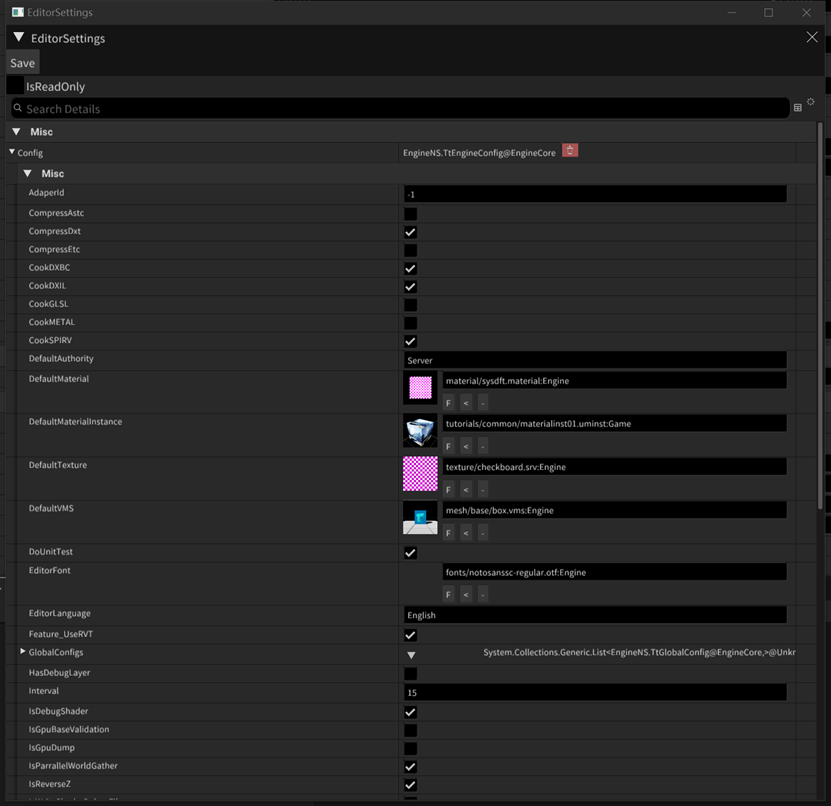

- 编辑Config
- - 
- - 点击Save后把配置存储到指定文件
- - 引擎通过启动参数config= 来指定配置文件
- - cache/config/engine.jscfg也是一个引擎配置文件，他会覆盖默认配置文件
- - content/config目录下有所有子系统的可以配置文件供项目配置，这些配置在cache/config下会有对应的为个人调试环境提供的同名覆盖配置文件,具体参考[增加一个Config配置文件](../Coding/CodeLib.md)
- 数据结构
```C#
    public partial class TtEngineConfig
    {
        public const int MajorVersion = 1;
        public const int MiniVersion = 4;
        public void SaveConfig(string sltFile)
        {
            IO.TtFileManager.SaveObjectToXml(sltFile, this);
        }
        [Rtti.Meta("")]
        public bool IsReverseZ { get; set; } = true;
        [Rtti.Meta("")]
        public EMultiRenderMode MultiRenderMode { get; set; } = EMultiRenderMode.QueueNextFrame;
        [Rtti.Meta("")]
        public bool UsePhysxMT { get; set; } = true;
        [Rtti.Meta("")]
        public bool UseRenderDoc { get; set; } = false;
        [Rtti.Meta("")]
        public bool Feature_UseRVT { get; set; } = false;
        public string ConfigName;
        [Rtti.Meta("")]
        public int NumOfThreadPool { get; set; } = -1;
        [Rtti.Meta("")]
        public bool IsParrallelWorldGather { get; set; } = true;
        int mInterval = 15;
        [Rtti.Meta("")]
        public int Interval {
            get => mInterval;
            set
            {
                mInterval = value;
                mTargetFps = 1000 / value;
            }
        }
        private int mTargetFps;
        public int TargetFps
        {
            get => mTargetFps;
        }
        [Rtti.Meta("")]
        public RName DefaultTexture { get; set; }
        [Rtti.Meta("")]
        public int AdaperId { get; set; }
        [Rtti.Meta("")]
        public Vector4 MainWindow { get; set; } = new Vector4(100, 100, 1280, 720);
        [Rtti.Meta("")]
        public bool SupportMultWindows { get; set; } = true;
        [Rtti.Meta("")]
        public bool DoUnitTest { get; set; } = true;
        [Rtti.Meta("")]
        public NxRHI.ERhiType RHIType { get; set; } = NxRHI.ERhiType.RHI_D3D11;
        [Rtti.Meta("")]
        public bool HasDebugLayer { get; set; } = false;
        [Rtti.Meta("")]
        public bool IsGpuBaseValidation { get; set; } = false;
        [Rtti.Meta("")]
        public bool IsDebugShader { get; set; } = false;
        [Rtti.Meta("")]
        public bool IsGpuDump { get; set; } = true;//if true, engine will disable debuglayer&renderdoc
        [Rtti.Meta("")]
        public string MainWindowType { get; set; }// = Rtti.TypeManager.Instance.GetTypeStringFromType(typeof(Editor.MainEditorWindow));
        [Rtti.Meta("")]
        public RName MainRPolicyName { get; set; }
        [Rtti.Meta("")]
        public RName SimpleRPolicyName { get; set; }
        [Rtti.Meta("")]
        public string RpcRootType { get; set; } = Rtti.TtTypeDesc.TypeStr(typeof(EngineNS.UTest.UTest_Rpc));
        [Rtti.Meta("")]
        public bool CookDXBC { get; set; } = true;
        [Rtti.Meta("")]
        public bool CookDXIL { get; set; } = false;
        [Rtti.Meta("")]
        public bool CookSPIRV { get; set; } = false;
        [Rtti.Meta("")]
        public bool CookGLSL { get; set; } = false;
        [Rtti.Meta("")]
        public bool CookMETAL { get; set; } = false;
        [Rtti.Meta("")]
        public bool CompressDxt { get; set; } = true;
        [Rtti.Meta("")]
        public bool CompressEtc { get; set; } = false;
        [Rtti.Meta("")]
        public bool CompressAstc { get; set; } = false;
        [Rtti.Meta("")]
        public RName DefaultVMS { get; set; } = RName.GetRName("mesh/base/box.vms", RName.ERNameType.Engine);
        [Rtti.Meta("")]
        public RName DefaultMaterial { get; set; }// = RName.GetRName("UTest/ttt.material");
        [Rtti.Meta("")]
        public RName DefaultMaterialInstance { get; set; }// = RName.GetRName("UTest/box_wite.uminst");
        [RName.PGRName(FilterExts = Bricks.CodeBuilder.TtMacross.AssetExt, MacrossType = typeof(GamePlay.UMacrossGame))]
        [Rtti.Meta("")]
        public RName PlayGameName { get; set; }
        [Rtti.Meta("")]
        public string RootServerURL { get; set; } = "127.0.0.1:2333";
        [Rtti.Meta("")]
        public Bricks.Network.RPC.EAuthority DefaultAuthority { get; set; } = Bricks.Network.RPC.EAuthority.Server;
        [Rtti.Meta("")]
        public List<TtGlobalConfig> GlobalConfigs { get; set; } = new List<TtGlobalConfig>();
        [Rtti.Meta("")]
        public RName EditorFont { get; set; }
        public string EditorLanguage { get; set; } = "English";
        [Rtti.Meta("")]
        public RName UIDefaultTexture { get; set; }
        [Rtti.Meta("")]
        public bool IsWriteShaderDebugFile { get; set; } = false;
        public TtEngineConfig()
        {
            //EditorFont = RName.GetRName("fonts/Roboto-Regular.ttf", RName.ERNameType.Engine);
            EditorFont = RName.GetRName("fonts/NotoSansSC-Regular.otf", RName.ERNameType.Engine);
            UIDefaultTexture = RName.GetRName("texture/white.srv", RName.ERNameType.Engine);
        }
    }
```
- 配置文件
```Json
{
  "IsReverseZ": true,
  "MultiRenderMode": 2,
  "UsePhysxMT": true,
  "UseRenderDoc": true,
  "Feature_UseRVT": true,
  "NumOfThreadPool": -1,
  "IsParrallelWorldGather": true,
  "Interval": 15,
  "TargetFps": 66,
  "DefaultTexture": "texture/checkboard.srv:Engine",
  "AdaperId": -1,
  "MainWindow": {
    "Left": 100,
    "Top": 100,
    "Right": 1280,
    "Bottom": 720,
    "TopLeft": 100,
    "TopRight": 100,
    "BottomRight": 1280,
    "BottomLeft": 720,
    "R": 100,
    "G": 100,
    "B": 1280,
    "A": 720
  },
  "SupportMultWindows": true,
  "DoUnitTest": true,
  "RHIType": "RHI_D3D12",
  "HasDebugLayer": false,
  "IsGpuBaseValidation": false,
  "IsDebugShader": true,
  "IsGpuDred": false,
  "IsAftermath": false,
  "MainWindowType": "EngineNS.Editor.TtMainEditorApplication@EngineCore",
  "MainRPolicyName": "utest/deferred.rpolicy:Game",
  "SimpleRPolicyName": "graphics/deferred_simple.rpolicy:Engine",
  "RpcRootType": "EngineNS.UTest.UTest_Rpc@EngineCore",
  "CookDXBC": true,
  "CookDXIL": true,
  "CookSPIRV": true,
  "CookGLSL": false,
  "CookMETAL": false,
  "CompressDxt": true,
  "CompressEtc": false,
  "CompressAstc": false,
  "DefaultVMS": "mesh/base/box.vms:Engine",
  "DefaultMaterial": "material/sysdft.material:Engine",
  "DefaultMaterialInstance": "tutorials/common/materialinst01.uminst:Game",
  "PlayGameName": "utest/test_game01.macross:Game",
  "RootServerURL": "127.0.0.1:2333",
  "DefaultAuthority": 2,
  "GlobalConfigs": [],
  "EditorFont": "fonts/notosanssc-regular.otf:Engine",
  "EditorLanguage": "English",
  "UIDefaultTexture": "texture/white.srv:Engine",
  "IsWriteShaderDebugFile": false,
  "Plugins": [
    "SourceGit",
    "DataCopyer",
    "Survivor"
  ],
  "MeshPrimitiveEditorConfig": {
    "MaterialName": "material/sysdft.material:Engine",
    "PlaneMaterialName": "material/whitecolor.uminst:Engine"
  }
}
```
- - UseRenderDoc：打开RenderDoc
- - HasDebugLayer：打开渲染Validation
- - IsGpuBaseValidation：打开GPU侧Validation
- - Feature_UseRVT：打开RVT
- - Interval：帧休息最大间隔
- - RHIType：选择RHI