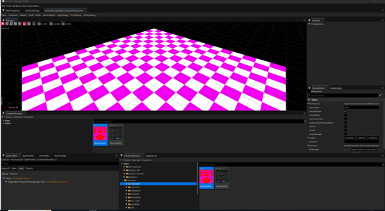
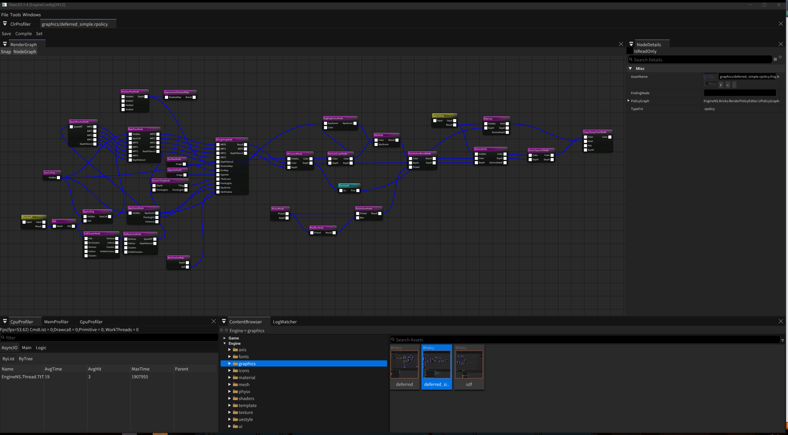

## [English Version](README-Eng.md)

# 为什么用TitanEngine

> **TitanEngine 的 Render Dependency Graph (`TtRenderGraph` / `TtAttachmentCache`) 横向对标 UE5 RDG / Unity URP-HDRP RG / Frostbite FrameGraph / Granite / O3DE Atom / Stride GraphicsCompositor / Falcor / Bevy bevy_render。**
>
> **一句话定位：业界第一档 RDG 能力 (拓扑剪枝 / 引用计数 / Transient 池化 / 自动 barrier 全部具备) + 业界少见的"主渲染管线可视化编辑器" + Permutation / RenderPolicy 资产化 — 三者同时具备的引擎全球不超过 5 个。** UE5 / Unity 的 RDG 都是纯 API，主管线无可视化。
>
> 完整对照表 / 演进路线图 / 设计哲学对比见 → **[documents/engine/RenderGraph.Industry.Compare.md](documents/engine/RenderGraph.Industry.Compare.md)**

# 编译运行环境
- Titan3D 启动！
- 
- 1.安装2022
- 2.安装C#开发环境
- 3.建议安装C#移动开发环境
# 引擎特色
- 1.C++/C#混合编程，C++作为底层，C#作为上层，通过自动胶水代码产生，C#可以完成完整调用C++功能
- 2.基于协程(Coroutines)的多线程构架，告别Callback Hell
- 3.基于宏图的图形化脚本构架，用户可以0代码实现超复杂游戏逻辑
- 4.完全用户自定义渲染管线，通过编辑器编辑RenderGraph，通过C#扩展RenderGraphNode，真正做到用户需要的一切效果都自定制
- 5.自带多进程服务器集群构架，大型MMO项目可用
- 6.基于HLSL的Shading开发，全平台Shader反射后统一了渲染资源绑定，是最接近原生DX开发用户习惯的模式
# 支持特性
- 1.支持DX11,DX12,Vulkan,OpenGLES(废弃)
- 2.支持Windows,Android平台
- 3.Amplification Shader,Mesh Shader,RayTracing Shader
- 4.图形化编辑器配置RenderGraph资产，引擎自带DeferredShading和MobileShading配置RenderGraph资产
- 5.图形化Material Shader编辑器
- 6.InGame UI编辑器支持2D，3D游戏UI编辑
- 7.GpuScene+IndirectDraw+Bindless为基础的GpuDriven框架
- 8.粒子系统，采用图形化逻辑编辑，支持CPU，GPU粒子切换
- 9.SDF字体，放缩友好
- 10.基于Node的场景编辑器，世界大纲可以为任何Node设置C#脚本
- 11.图形化动作状态机，和宏图配合完成游戏逻辑
- 12.图形化脚本编辑器，宏图(Macross)系统几乎可以全功能实现引擎项目功能
- 13.内嵌RenderDoc，可以config配置
- 14.基于TCP/IP的RPC网络通讯，自带超大型服务器集群构架
- 15.采用双精度坐标，支持CDLOD地形，先天无限世界圣体
- 16.Excel数据自动映射数据结构，自动读写
- 17.插件动态加载卸载，游戏，引擎功能都可通过插件扩展
- 18.专用的prefab编辑器
# 当前缺省RenderGraph支持典型节点列表

一切都渲染流程都是节点链接配置出来，所以不要问引擎支持什么渲染特性，扩充和组合节点决定了最终的渲染管线效果
- 1.CullClusterNode,SwRastererizeNode,QuakResolveNode等一系列节点，用来实现软光栅渲染（尚未完全完成）
- 2.Hzb，depth clip map用来做深度裁剪
- 3.CpuCulling，在CPU内处理出可见Node列表
- 4.DeferredBassPass，延迟渲染，3或者4RT输出，最后一个velocity输出可配置
- 5.ShadowMap，经典CSM阴影
- 6.ScreenTiling，屏幕分块，目前主要记录影响的点光源
- 7.AdvShadow，基于QTree Clip Map的大范围阴影处理
- 6.DirLighting，平行光等的PBR延迟着色
- 7.Forward，前向节点，主要处理半透明一类的渲染
- 8.Particle，用来处理粒子系统的驱动和渲染
- 9.AvgBright,HDR用来处理动态光照tonemapping,eye adapter
- 10.Picked,PickBlur,PickHollow,PickHollowBlend,HitProxy用来处理编辑器等的像素点选
- 11.ScreenSpaceUI，用来处理屏幕空间UI渲染（3d UI直接在base pass或者forward中处理）
- 12.其他效果节点
- - 1.VoxelNode，从视口创建稀疏体素
- - 2.FogNode，高度雾
- - 3.LuminanceThredhole，提取亮度区间
- - 4.Bloom，顾名思义
- - 5.Additive，叠加颜色
- - 6.SunShaftDepthThreshole,SunShaftRadialBlur用来做God Ray的系列节点
- - 7.Taa，时域反走样，和前面输出的velocity配合使用
- 13.实时全局光照与降噪节点 (ReSTIR GI Pipeline)
- - 1.ReSTIRGI (`TtReSTIRGINode`)，基于 [ReSTIR GI](https://research.nvidia.com/publication/2021-06_restir-gi-path-resampling-real-time-path-tracing) 论文的实时全局光照, 单节点内含 4 个 compute pass: Initial Sampling / Temporal Reuse / Spatial Reuse / Resolve, 支持硬件 RT (DXR) 和软件 RT (SDF / BVH) Permutation 切换, 支持 SkyCube / 常量天光两种 miss 着色模式
- - 2.Denoise (`TtDenoiseNode`)，空间 + 时域联合降噪节点, 一个节点串完整条降噪管线:
- - - 空间降噪: à-trous wavelet edge-aware bilateral filter, 多迭代 ping-pong (默认 4 iter, StepSize = 1/2/4/8), 用 GBuffer Normal + Depth 做 edge-stopping, 内置 firefly luminance clamp 消除 ReSTIR resolve 偶发 outlier
- - - 时域降噪: motion-vector reprojection + history ping-pong + 法线/深度一致性校验, 是低 spp ReSTIR / SSR 模式下消除帧间闪烁的关键 pass, 可通过 `EnableTemporal` 开关 (MotionVector pin 未连时自动 fallback 到纯空间降噪)
# 编译构建
## Windows编译引擎
1. **第一次编译引擎，很多时候需要单独调试运行CppWeavingTools和CSharpCodeTools两个工程一次，确保codegen下面NativeBinder和Cs2Cpp目录产生了必要的临时cpp,cs文件** 
2. 如果第一次产生NativeBinder失败，有可能需要安装llvm
3. 编译Core.Window工程（C++）
4. 编译Engine.Window工程（C#）
5. 编译MainEditor工程（C#）
7. **第一次可能需要手工编译下列插件工程**
- - SourceGit
- - DataCopyer
7. **因为github的LFS限制，可能需要手工解压一些压缩文件，清单如下**
- - binaries\Tools\net8.0\libclang.7z
## Windows编译Android APK
1. 编译Core.Android工程（C++）
2. 编译Engine.Android程（C#）
# 调试与运行
1. 设置MainEditor为当前项目
2. 调试命令行参数为config=\$(SolutionDir)content\EngineConfig.cfg use_renderdoc=false
3. 调试工作目录为$(SolutionDir)binaries\
4. 运行与调试，请阅读[**引擎配置与编辑器使用文档**](Documents/Index.md)。
5. 遇到一些奇怪IO相关Crash或者异常，可以尝试删除本地cache目录
# 开发者注意事项
1. 不要提交大文件(20M以上)，避免lfs使用
2. [常用代码](CodeLib.md)
3. **新增加了C++的Bricks一定要记得添加对应宏**，否则会C#找不到C++函数，方法参阅注意事项2
# 控制台程序
## 特殊参数
- 1.ExeCmd=决定执行的命令
- 2.ExtraCmd={n}这个n是确定启动后，控制台可以输入的参数个数
## 保存资产到最新
- 保存指定资产到最新版本，解决MetaVersion爆炸问题
ExeCmd=SaveAsLastest AssetType=Scene+Mesh+Material+MaterialInst+Texture CookCfg=\$(SolutionDir)content\EngineConfigForCook.cfg 
## 启动Root服务器
- 方法1：ExeCmd=StartRootServer CookCfg=\$(SolutionDir)content\EngineConfigForRootServer.cfg 
- 方法2：ExtraCmd=1 CookCfg=$(SolutionDir)content\EngineConfigForRootServer.cfg 在控制台输入ExeCmd=StartRootServer
## 启动Login服务器
- 方法1：ExeCmd=StartLoginServer CookCfg=\$(SolutionDir)content\EngineConfigForRootServer.cfg 
- 方法2：ExtraCmd=1 CookCfg=$(SolutionDir)content\EngineConfigForRootServer.cfg 在控制台输入ExeCmd=StartLoginServer
## 升级CppWeavingTools
- 升级Nuget的libclang，本机查找Microsoft Visual Studio\2022\Enterprise\VC\Tools\Llvm\x64\bin拷贝到binaries\Tools\对应.net版本
- 右键libClangSharp查看nuget文件位置
## 授权许可证
- 采用[LGPL v3 许可](LICENSE.md)